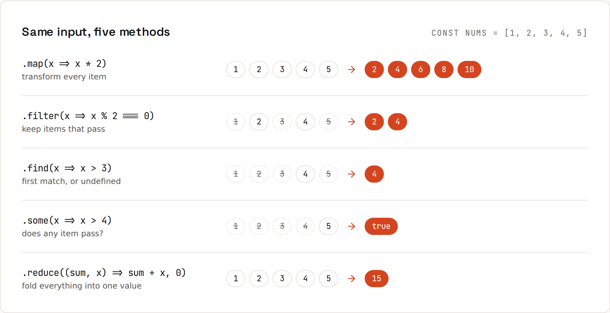

# Arrays and Array Methods

**map, filter, reduce: watch the data move.** Array methods replace most loops with a description of the result. Output from `code/javascript/arrays.mjs`.



## The core methods
```
map(x => x * 2)         [ 2, 4, 6, 8, 10 ]
filter(x => x % 2)      [ 1, 3, 5 ]
reduce((a, x) => a + x) 15
find(x => x > 2)        3 | findIndex: 2 | findLast: 3
some(x => x > 4)        true | every(x => x > 0): true
includes(3)             true | indexOf(9): -1 | at(-1): 5
slice(1, 3)             [ 2, 3 ] | original: [ 1, 2, 3, 4, 5 ]
flat / flatMap          [ 1, 2, 3, [ 4 ] ] [ 1, 2, 3, 4 ] [ 'a', 'b', 'c' ]
join / Array.from       1-2-3-4-5 [ 0, 1, 4 ] [ 'h', 'e', 'y' ]
```
| Method | Returns | Use to |
|---|---|---|
| `map(fn)` | new array, same length | transform every item |
| `filter(fn)` | new array, fewer items | keep matching items |
| `reduce(fn, init)` | one value | sum, count, build an object |
| `find` / `findIndex` / `findLast` | item / index / last item | first match |
| `some` / `every` | boolean | "any?" / "all?" |
| `includes` / `indexOf` | boolean / index | membership |
| `at(-1)` | item | last element |
| `slice(a, b)` | copy of a range | take part |
| `flat()` / `flatMap(fn)` | flattened array | nested arrays |
| `join(sep)` | string | output |
| `Array.from(x, fn)` | new array | from iterables or `{ length: n }` |

## Chaining
```js
const adults = users.filter((u) => u.age >= 18).map((u) => u.name).toSorted();
const total = cart.reduce((sum, i) => sum + i.price * i.qty, 0);
Object.groupBy(users, (u) => u.city);
```
```
adult names, sorted: [ 'Ada', 'Alan', 'Grace' ]
cart total: 900
groupBy city: [Object: null prototype] {
  London: [
    { name: 'Ada', age: 36, city: 'London' },
    { name: 'Alan', age: 41, city: 'London' }
  ],
  Helsinki: [ { name: 'Linus', age: 17, city: 'Helsinki' } ],
  'New York': [ { name: 'Grace', age: 85, city: 'New York' } ]
}
```

## Some methods change the original
`map`, `filter` and friends return a new array. `sort()`, `reverse()`, `splice()`, `push/pop/shift/unshift` and `fill` **mutate in place**. Reach for `toSorted()`, `toReversed()`, `toSpliced()` and `with()` when you want a copy.
```
toSorted: [ 'a', 'b', 'c' ] original: [ 'c', 'a', 'b' ]
sort() changed the original: [ 'a', 'b', 'c' ]
splice(1, 2, 'x') removed [ 2, 3 ] -> arr [ 1, 'x', 4 ] | toSpliced leaves the original: [ 2, 3 ] | with(0, 9): [ 9, 2, 3 ]
push/pop/shift/unshift: { a: [ 2 ], last: 3, firstEl: 1 }
```

## Sorting numbers
```
[10, 9, 1, 2].sort() = [ 1, 10, 2, 9 ] | with a comparator: [ 1, 2, 9, 10 ]
```
Default `sort` compares **strings**. Numbers need a comparator: `(a, b) => a - b` (ascending), `b - a` (descending). Objects: `users.toSorted((a, b) => a.name.localeCompare(b.name))`.

## Loops
```
  for...of 1
  for...of 2
  forEach index 0 value 1
```
`for…of` can `break`, `continue`, `return` and `await`. `forEach` can't be stopped and ignores `await`. Use `for…of` when you need control, array methods when you're transforming.

## Two gotchas
```
empty reduce without initial value: TypeError: Reduce of empty array with no initial value
['1','2','3'].map(parseInt) = [ 1, NaN, NaN ] | .map(Number) = [ 1, 2, 3 ]
```
- Always pass `reduce` an initial value.
- `map` passes `(item, index, array)`; `parseInt` takes `(string, radix)`, so index 1 and 2 become the radix. Use `map(Number)` or `map((s) => parseInt(s, 10))`.

## Copying and combining
`[...a]` or `a.slice()` (shallow copy), `[...a, ...b]` (concatenate), `structuredClone(a)` (deep), `Array.isArray(x)`, `a.length = 0` (empty in place).
