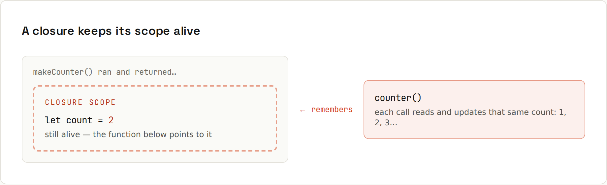

# Closures

**Functions remember where they were born.** A closure is a function plus the variables that were in scope when it was created. It's how JavaScript does private state, callbacks, and much of React. Output from `code/javascript/functions.mjs`.



## Private state
```js
function makeCounter() {
  let count = 0;                   // private: nothing outside can touch it
  return () => ++count;
}
const counter = makeCounter();
const other = makeCounter();
console.log(counter(), counter(), counter(), "| other:", other());
```
```
1 2 3 | other: 1
```
`makeCounter` has finished, yet `count` lives on, because the returned arrow function still references it. Each call to `makeCounter` creates a **new** scope, so `other` has its own `count`.

## Function factories
```js
const makeAdder = (n) => (x) => x + n;
const add10 = makeAdder(10);
add10(5);   // 15
```

## Run once
```js
function once(fn) {
  let done = false, result;
  return (...args) => (done ? result : ((done = true), (result = fn(...args))));
}
const init = once(() => { console.log("  initialising..."); return 42; });
console.log(init(), init());
```
```
  initialising...
42 42
```

## The `var`-in-a-loop trap
```js
const withVar = [], withLet = [];
for (var i = 0; i < 3; i++) withVar.push(() => i);
for (let j = 0; j < 3; j++) withLet.push(() => j);
console.log("var:", withVar.map((f) => f()), "let:", withLet.map((f) => f()));
```
```
var: [ 3, 3, 3 ] let: [ 0, 1, 2 ]
```
With `var` there is **one** `i` for the whole function; all three closures see its final value, 3. `let` creates a fresh binding per iteration. Another reason to never use `var` ([[javascript/Variables and Scope]]).

## Closures everywhere
- **Event handlers** remember the element or data they were created for ([[javascript/Events]]).
- **Callbacks** in `setTimeout`, `fetch().then`, `map` use variables of the surrounding function.
- **Debounce/throttle** keep their timer in a closure ([[javascript/Functions]]).
- **React hooks**: every render's event handlers close over that render's state. "Stale closure" bugs are handlers that still see old state.
- **Modules** are like one big closure: top-level variables are private unless exported.

## Memory
A closure keeps its captured variables alive as long as the function is reachable. An event listener that closes over a huge array keeps that array in memory until the listener is removed. Usually harmless; occasionally a leak in long-running single-page apps.
