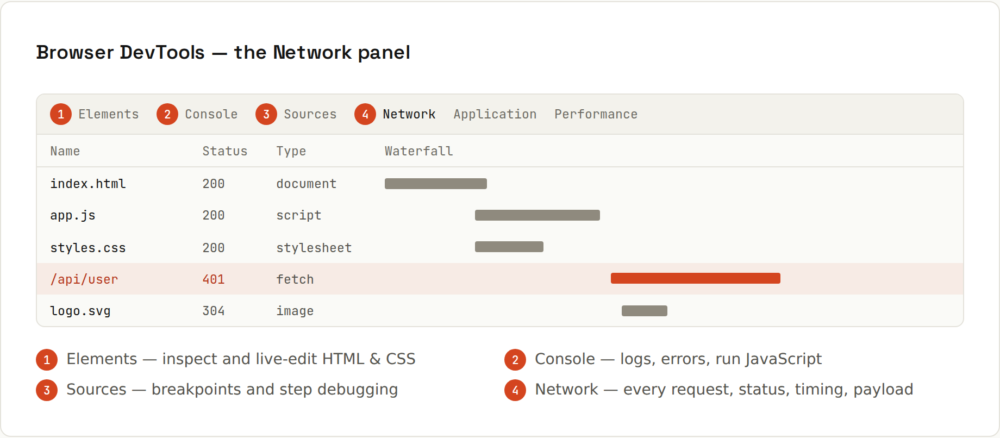

# DevTools

The browser's developer tools (<kbd>F12</kbd>, or right-click → *Inspect*) show what the page is doing: the DOM, logs, source with breakpoints, and every network request. Chrome, Edge and Firefox DevTools are very similar.



## The panels
| Panel | For |
|---|---|
| **Elements** | the live DOM and CSS: edit styles, see the box model, find why a style doesn't apply |
| **Console** | logs, errors, and a place to run JavaScript against the page |
| **Sources** | your code, breakpoints, step-through debugging |
| **Network** | every request: status, headers, payload, response, timing |
| **Application** | storage (localStorage, cookies, IndexedDB), service workers, manifest |
| **Performance** | record and analyse slow interactions and rendering |
| **Lighthouse** | audits for performance, accessibility, SEO, best practices |

Toggle the **device toolbar** (<kbd>Ctrl</kbd>+<kbd>Shift</kbd>+<kbd>M</kbd>) to test phone sizes.

## Console beyond `console.log`
```js
console.table(users);              // arrays of objects as a table
console.group("checkout");         // collapsible, indented logs
console.log("items", cart.items);
console.groupEnd();
console.time("render");            // measure how long something takes
render();
console.timeEnd("render");         // render: 12.4 ms
console.error("red, with a stack trace"); console.warn("yellow");
console.log({ user, cart });       // object shorthand: labelled values
debugger;                          // pause here when DevTools is open
```
In the console: `$0` is the element selected in Elements, `$$("li")` = `querySelectorAll` as an array, `copy(obj)` copies to the clipboard.

## Debugging with breakpoints
Instead of `console.log` everywhere:
1. **Sources** → open your file (<kbd>Ctrl</kbd>+<kbd>P</kbd>) → click a line number.
2. Trigger the code. Execution pauses there.
3. Hover variables, look at **Scope** and **Call Stack**, step over/into/out.
4. Right-click a breakpoint → *conditional breakpoint* (`id === 42`) or *logpoint* (logs without changing code).

Also: **pause on exceptions**, **XHR/fetch breakpoints** (pause when a URL is requested), **DOM breakpoints** (pause when an element changes), **event listener breakpoints** (pause on any click). Same ideas as in an IDE debugger ([[IDEs/Debugging]]).

## Network panel
- Filter by **Fetch/XHR** to see API calls; click one for **Headers**, **Payload**, **Preview**, **Response**, **Timing**.
- Red rows are failed requests; check the status code ([[javascript/Fetch and HTTP]]).
- **Disable cache** while DevTools is open; **throttle** to "Slow 4G" to feel what mobile users feel.
- Right-click → *Copy as cURL / fetch* to replay a request.
- CORS errors appear in the Console, with the blocked request in Network.

## Source maps
Bundlers produce minified code; source maps let DevTools show your original TypeScript/JSX files and line numbers in stack traces and breakpoints. Most tools generate them in development automatically.

## Node.js
`node --inspect app.mjs` (or `--inspect-brk` to pause at the start), then open `chrome://inspect`: the same debugger for server code. VS Code and IntelliJ can attach directly ([[IDEs/Debugging in Depth]]).
