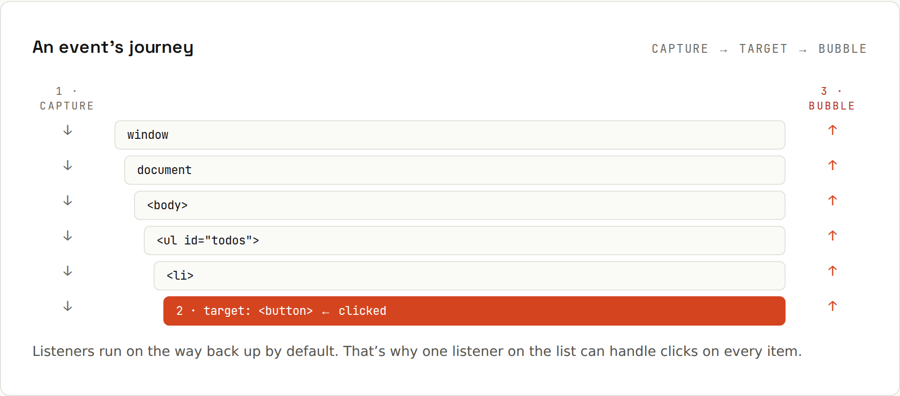

# Events

Clicks, key presses, form submits and page loads are **events**. You register listeners; the browser calls them as tasks on the event loop. All output below was recorded in Chromium with Playwright clicking the page (`code/javascript/browser/`).

## Listening
```js
button.addEventListener("click", (event) => {
  console.log("clicked", event.target);
});
```
| Common events | Fired when |
|---|---|
| `click`, `dblclick`, `contextmenu` | mouse/touch activation |
| `input`, `change` | a field's value changes (every keystroke / on commit) |
| `submit` | a form is submitted (by button or Enter) |
| `keydown`, `keyup` | keys (`event.key === "Enter"`) |
| `focus`, `blur`, `focusin`, `focusout` | focus moves |
| `pointerdown/move/up` | mouse, pen and touch uniformly |
| `scroll`, `resize` | throttle/debounce these |
| `DOMContentLoaded`, `load` | the HTML is parsed / everything loaded |

Remove with `removeEventListener` (same function reference) or `{ once: true }` / an `AbortSignal` option.

## Forms: prevent the default
```js
document.querySelector("#order").addEventListener("submit", (event) => {
  event.preventDefault();          // stop the page from reloading
  const data = new FormData(event.target);
  console.log("submit prevented, email =", data.get("email"));
});
```
```
submit prevented, email = ada@example.com
```
Listen to `submit` on the form, not `click` on the button: it also catches Enter and keeps built-in validation (`required`, `type="email"`).

## An event's journey


A click travels **down** from `window` to the target (capture phase), then **up** again (bubble phase). With listeners on `#outer > #inner > #target`:
```js
for (const id of ["outer", "inner", "target"]) {
  const el = document.getElementById(id);
  el.addEventListener("click", () => console.log("capture", id), { capture: true });
  el.addEventListener("click", (e) => console.log("bubble ", id, e.eventPhase === 2 ? "(target phase)" : ""));
}
```
Clicking the span:
```
capture outer
capture inner
capture target
bubble  target (target phase)
bubble  inner 
bubble  outer 
```
With `event.stopPropagation()` in the inner listener (on shift+click):
```
capture outer
capture inner
capture target
bubble  target (target phase)
bubble  inner 
stopPropagation at inner
```
`outer` never hears the bubble. Use `stopPropagation` sparingly: other code (analytics, dropdowns closing on outside click) may rely on bubbling.

## Event delegation
Because events bubble, **one** listener on a parent can handle all children, including ones added later:
```js
// One listener handles every current AND future <li>
list.addEventListener("click", (event) => {
  const item = event.target.closest("li");
  if (!item) return;
  item.classList.toggle("done");
  console.log("toggled", item.textContent, "->", item.className);
});
```
Clicking "Cake" twice, then the `<li>` added by script afterwards:
```
toggled Cake -> done
toggled Cake -> 
toggled  -> done
```
`event.target` is the element actually clicked (maybe a `<span>` inside the `<li>`); `closest("li")` finds the item. `event.currentTarget` is the element the listener is on.

## `this` in listeners
In a `function` listener, `this` is the element; in an arrow function, it's the outer `this` ([[javascript/The this Keyword]]). Use `event.currentTarget` and you don't need to care.

## Custom events
```js
cart.dispatchEvent(new CustomEvent("cart:changed", { detail: { items: 3 }, bubbles: true }));
document.addEventListener("cart:changed", (e) => updateBadge(e.detail.items));
```

## Accessibility
Use real `<button>`s and `<a href>`s: they're focusable and work with the keyboard for free. A `<div onclick>` needs `role`, `tabindex` and key handling to be usable without a mouse.
