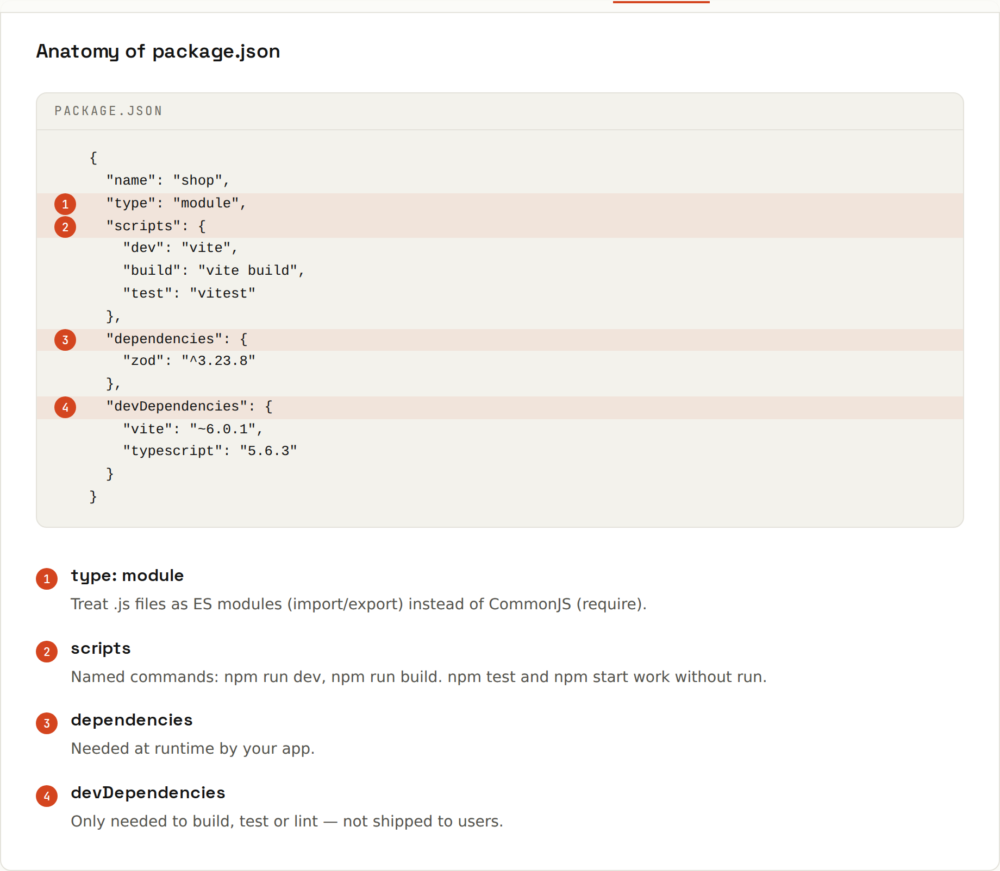

# npm and package.json

**npm** is Node's package manager and the registry of over two million packages. `package.json` describes your project: its dependencies, scripts and metadata.



## A realistic package.json
```json
{
  "name": "shop",
  "version": "1.0.0",
  "private": true,
  "type": "module",
  "scripts": {
    "dev": "vite",
    "build": "vite build",
    "test": "vitest run",
    "lint": "eslint ."
  },
  "dependencies": {
    "zod": "^3.23.8"
  },
  "devDependencies": {
    "eslint": "^9.12.0",
    "typescript": "~5.9.2",
    "vite": "^7.1.0",
    "vitest": "^3.2.4"
  },
  "engines": { "node": ">=22" }
}
```
| Field | Means |
|---|---|
| `private: true` | can't be published to npm by accident |
| `type: "module"` | `.js` files are ES modules ([[javascript/Modules]]) |
| `scripts` | commands: `npm run dev`, `npm test`, `npm run build` |
| `dependencies` | needed at runtime |
| `devDependencies` | only for development and building (linters, test runners, TypeScript, bundlers) |
| `engines` | which Node versions are supported |

## Commands
| Command | What it does |
|---|---|
| `npm init -y` | create `package.json` |
| `npm install zod` | add a dependency |
| `npm install -D eslint` | add a dev-only tool |
| `npm install` | install everything from `package.json` (updates the lock file if needed) |
| `npm ci` | exact install from the lock file, deleting `node_modules` first (CI) |
| `npm run dev` | run a script |
| `npx <tool>` | run a package without installing it globally |
| `npm outdated` / `npm update` | check / apply updates within your ranges |
| `npm uninstall zod` | remove |
| `npm ls zod` | why is this package installed? |
| `npm audit` | known vulnerabilities |

## Version ranges
| Range | Allows | Example |
|---|---|---|
| `^3.23.8` | minor + patch updates | 3.24.0 ✓  4.0.0 ✗ |
| `~6.0.1` | patch updates only | 6.0.9 ✓  6.1.0 ✗ |
| `5.6.3` | exactly that version | 5.6.4 ✗ |
| `^0.4.2` | careful: 0.x is treated as unstable | 0.4.9 ✓  0.5.0 ✗ |

(Checked with npm's own `semver` package.) Versions follow semantic versioning: [[github/Releases and Pages]].

## Commit the lock file
`package-lock.json` records the exact version of every package, including dependencies of dependencies. **Commit it**, and use `npm ci` in CI so every install is identical. Never commit `node_modules/` ([[git/Ignoring Files]]).

## pnpm, Yarn, Bun
Alternative package managers with the same `package.json`:
- **pnpm**: fast, disk-efficient (one global store, links), strict about undeclared dependencies.
- **Yarn**: popular in older React projects.
- **Bun**: extremely fast installs.

Use whatever the project's lock file says (`pnpm-lock.yaml`, `yarn.lock`, `bun.lock`). Mixing managers causes confusing bugs.

## Choosing packages
Before adding a dependency, check: weekly downloads, last release date, open issues, bundle size (bundlephobia.com), license. Every dependency is code you ship and must keep updated. For tiny helpers (left-pad!), write the three lines yourself.

## Supply-chain safety
Packages run code at install time (`postinstall` scripts) and at runtime. Keep dependencies few, updated and locked; enable Dependabot ([[github/Security]]); be suspicious of typo-squatted names (`reqeusts`).
