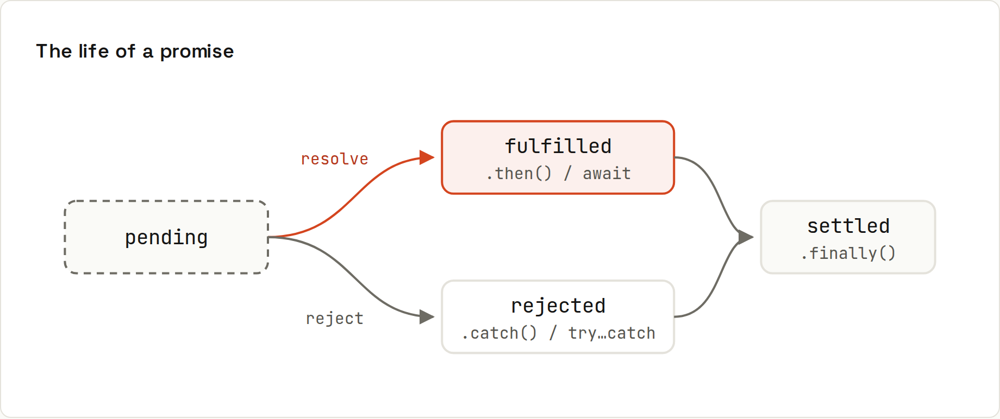

# Promises

**A promise is a value that arrives later.** It starts *pending* and settles exactly once: *fulfilled* with a value or *rejected* with an error. `async/await` is a nicer way to write the same thing ([[javascript/Async and Await]]). Output from `code/javascript/promises.mjs`.



## Creating and consuming
```js
const wait = (ms, value, fail = false) =>
  new Promise((resolve, reject) => setTimeout(() => (fail ? reject(new Error(value)) : resolve(value)), ms));

const p = wait(50, "done");
console.log("right away:", p);
p.then((v) => console.log("later:", v, p));

wait(20, "boom", true)
  .then((v) => console.log("never", v))
  .catch((err) => console.log("caught:", err.message))
  .finally(() => console.log("finally runs either way"));
```
```
right away: Promise { <pending> }
caught: boom
finally runs either way
later: done Promise { 'done' }
```
- `.then(fn)` runs when fulfilled and returns a **new** promise, so calls chain.
- `.catch(fn)` handles a rejection anywhere earlier in the chain.
- `.finally(fn)` runs either way (hide a spinner, close a connection).
- Returning a promise from `.then` waits for it; throwing inside `.then` rejects the chain.

You rarely call `new Promise` yourself: `fetch`, `fs/promises`, database drivers already return promises. Use it to wrap callback-based APIs (like `setTimeout` above).

## Combinators
| Method | Settles when | Result |
|---|---|---|
| `Promise.all([...])` | all fulfil, or **the first rejects** | array of values |
| `Promise.allSettled([...])` | all settle | `[{status, value \| reason}, …]` |
| `Promise.race([...])` | the first settles | its value or error |
| `Promise.any([...])` | the first **fulfils** (or all reject: `AggregateError`) | its value |

```
Promise.all rejects on the first failure: service down
allSettled: fulfilled:ok, rejected:service down
race: fast | any: first success
```
A timeout with `race`:
```js
const withTimeout = (promise, ms) => Promise.race([promise, wait(ms, `timed out after ${ms} ms`, true)]);
await withTimeout(wait(500, "too slow"), 100);
```
```
timed out after 100 ms
```
(For `fetch`, prefer `AbortSignal.timeout(ms)`, which actually cancels the request: [[javascript/Fetch and HTTP]].)

## Unhandled rejections
A rejected promise nobody catches:
```js
process.on("unhandledRejection", (reason) => console.log("unhandledRejection:", reason.message));
wait(1, "nobody catches me", true);
```
```
unhandledRejection: nobody catches me
```
Without that handler, Node **crashes the process** on an unhandled rejection (since Node 15); browsers log "Uncaught (in promise)" in the console. Every promise chain needs a `.catch` or a `try/catch` around its `await` somewhere.

## Callback hell → promises → async/await
```js
// callbacks: nesting grows with every step
getUser(id, (err, user) => { if (err) …; getOrders(user, (err, orders) => { … }); });
// promises: a flat chain
getUser(id).then(getOrders).then(render).catch(showError);
// async/await: reads like synchronous code
const user = await getUser(id); const orders = await getOrders(user); render(orders);
```
Promise callbacks run as **microtasks** ([[javascript/The Event Loop]]).
