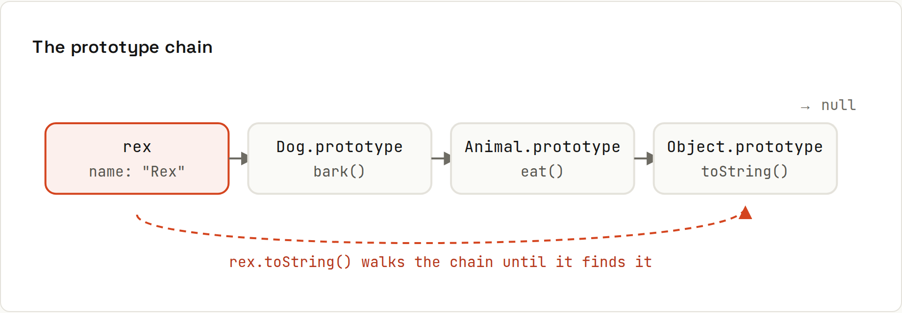

# Prototypes and Classes

**Objects inherit from other objects, through a chain.** Every object has a hidden link to a **prototype**. Property lookups walk that chain. `class` syntax is a friendlier way to set it up; underneath, it's still prototypes. Output from `code/javascript/classes.mjs`.



## Classes
```js
class Animal {
  #energy = 10;                     // truly private field
  static count = 0;
  constructor(name) { this.name = name; Animal.count++; }
  eat() { this.#energy++; return this; }
  get energy() { return this.#energy; }
  toString() { return `${this.constructor.name}(${this.name})`; }
}
class Dog extends Animal {
  bark() { return `${this.name}: woof`; }
  eat() { super.eat(); return super.eat(); }   // dogs eat twice
}
const rex = new Dog("Rex");
```
```
Rex: woof | energy after eat(): 12 | count: 1 | Dog(Rex)
rex.#energy from outside? SyntaxError
```
| Feature | Syntax |
|---|---|
| constructor | `constructor(name) { this.name = name; }` |
| public field | `total = 0;` |
| private field / method | `#energy = 10;`, `#validate() {}`: a real language-level secret, a `SyntaxError` from outside |
| static | `static count = 0;`, `static from(json) {}` |
| getter / setter | `get energy() {}`, `set energy(v) {}` |
| inheritance | `class Dog extends Animal`, `super(...)`, `super.eat()` |

A class must be called with `new`:
```
TypeError: Class constructor Dog cannot be invoked without 'new'
```

## The chain, verified
```js
Object.getPrototypeOf(rex) === Dog.prototype              // true
Object.getPrototypeOf(Dog.prototype) === Animal.prototype // true
Object.getPrototypeOf(Animal.prototype) === Object.prototype // true
Object.getPrototypeOf(Object.prototype)                  // null: the end
```
```
true true true null
rex has own 'bark'? false | 'bark' in rex? true | own keys: [ 'name' ]
rex instanceof Animal: true | typeof Dog: function
```
`bark` isn't on `rex` itself: it lives once on `Dog.prototype`, shared by all dogs. `rex.bark()` finds it by walking up the chain. That's why adding a method to the prototype later affects existing objects:
```js
Dog.prototype.fetch = function () { return `${this.name} fetches`; };
rex.fetch();   // "Rex fetches"
```
(Never do this to built-ins like `Array.prototype` in real code.)

## Prototypes without classes
```js
const proto = { hello() { return `hello from ${this.name}`; } };
const plain = Object.create(proto);
plain.name = "plain object";
plain.hello();   // "hello from plain object"
```

## Classes vs plain objects and functions
JavaScript doesn't force OOP. Many codebases (and React) prefer plain objects + functions; classes shine for things with identity and behaviour (a `Cart`, an `ApiClient`, custom errors). Prefer **composition** over deep `extends` chains, same as in Java ([[java/Inheritance and Composition]]).

## `this` in classes
Class methods lose `this` when passed as callbacks: [[javascript/The this Keyword]].
