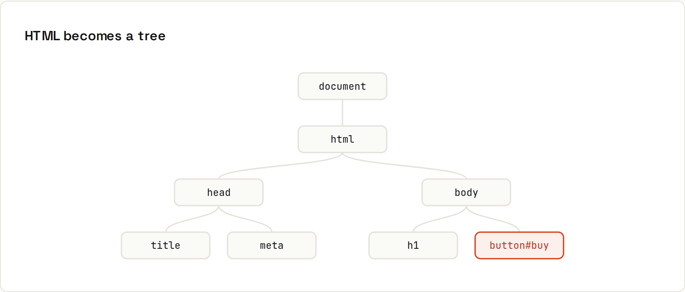

# The DOM

**The page is a tree of objects you can read, change and listen to.** The browser turns HTML into the **DOM** (Document Object Model), a tree of nodes. JavaScript finds nodes, updates them and reacts to events. Output from `code/javascript/browser/`, run in Chromium.



## Find
```js
const button = document.querySelector("#buy");          // first match (or null)
const items = document.querySelectorAll("#todos li");    // all matches (a static NodeList)
console.log("found", items.length, "items; first:", items[0].textContent);
```
```
found 2 items; first: Tea
```
Selectors are CSS selectors: `#id`, `.class`, `li:nth-child(2)`, `[data-id="42"]`, `form input[name=email]`. Also `el.closest("li")` (nearest ancestor matching), `el.matches(".done")`, `document.getElementById("buy")`.

A script in `<head>` without `defer`/`type="module"` runs before the body exists: `querySelector` returns `null` and the next line throws `Cannot read properties of null`. → [[javascript/Running JavaScript]]

## Change
```js
button.textContent = "Added!";
button.classList.add("is-done");
button.setAttribute("aria-pressed", "true");
console.log("button now:", button.outerHTML);
```
```
button now: <button id="buy" type="submit" class="is-done" aria-pressed="true">Added!</button>
```
| Change | API |
|---|---|
| text | `el.textContent = "…"` |
| classes | `el.classList.add / remove / toggle / contains` |
| attributes | `el.setAttribute`, `getAttribute`, `removeAttribute`, `el.dataset.id` (for `data-id`) |
| inline style | `el.style.display = "none"` (prefer toggling classes) |
| form values | `input.value`, `checkbox.checked`, `select.value` |
| visibility | `el.hidden = true` |

## Create and remove
```js
const li = document.createElement("li");
li.textContent = "";   // textContent never runs HTML
list.append(li);
console.log("safe li:", li.outerHTML);
```
```
safe li: <li>&lt;img src=x onerror=alert(1)&gt;</li>
```
The would-be attack is displayed as harmless text. `append`, `prepend`, `before`, `after`, `replaceWith`, `remove()`; `<template>` elements for bigger chunks of markup.

> **Never put user input into `innerHTML`.** `el.innerHTML = userInput` lets anyone inject scripts (XSS). Use `textContent` for text, or a framework that escapes for you. → [[javascript/Security]]

## Performance
- Reading layout (`offsetHeight`, `getBoundingClientRect`) right after changing styles forces the browser to recalculate layout. Batch reads, then writes.
- Building many elements? Create them in a `DocumentFragment` or build one string of **trusted** HTML, then insert once.
- Animations: CSS transitions or `requestAnimationFrame`, not `setInterval`.

## Frameworks
React, Vue, Svelte and Angular manage the DOM for you: you describe what the UI should look like for the current state, and they apply the minimal changes. Understanding the DOM still matters for debugging, performance and accessibility.
