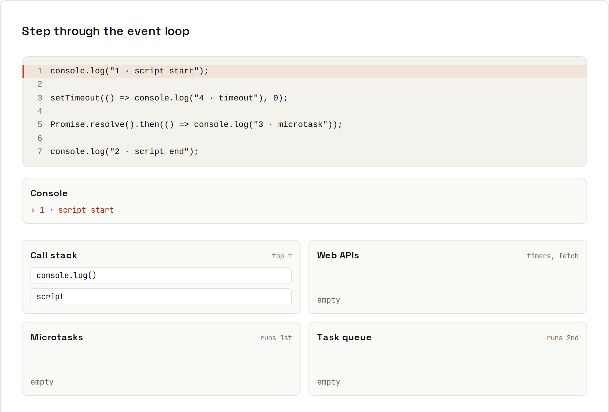
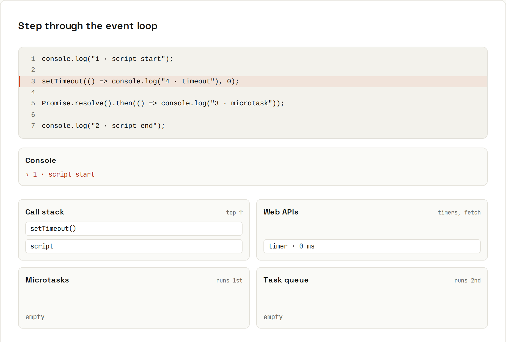
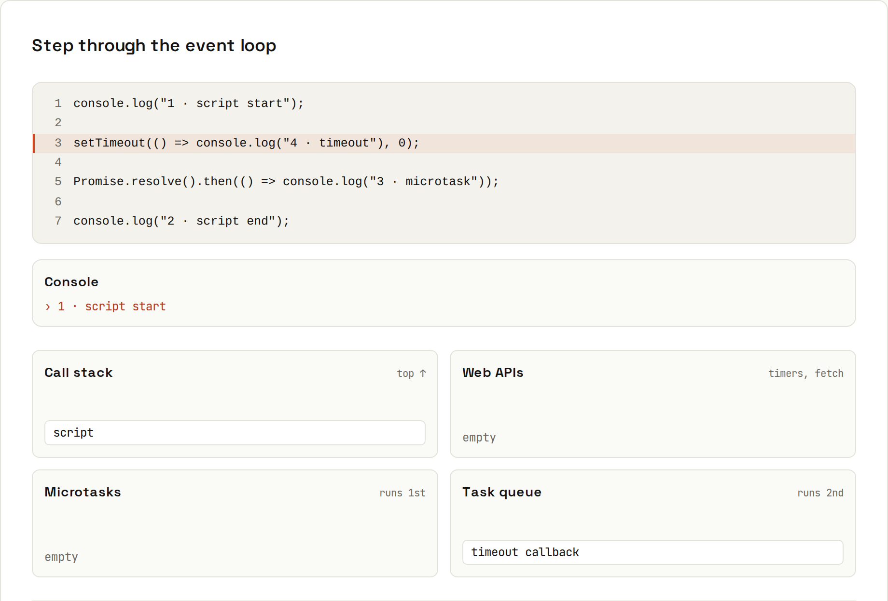
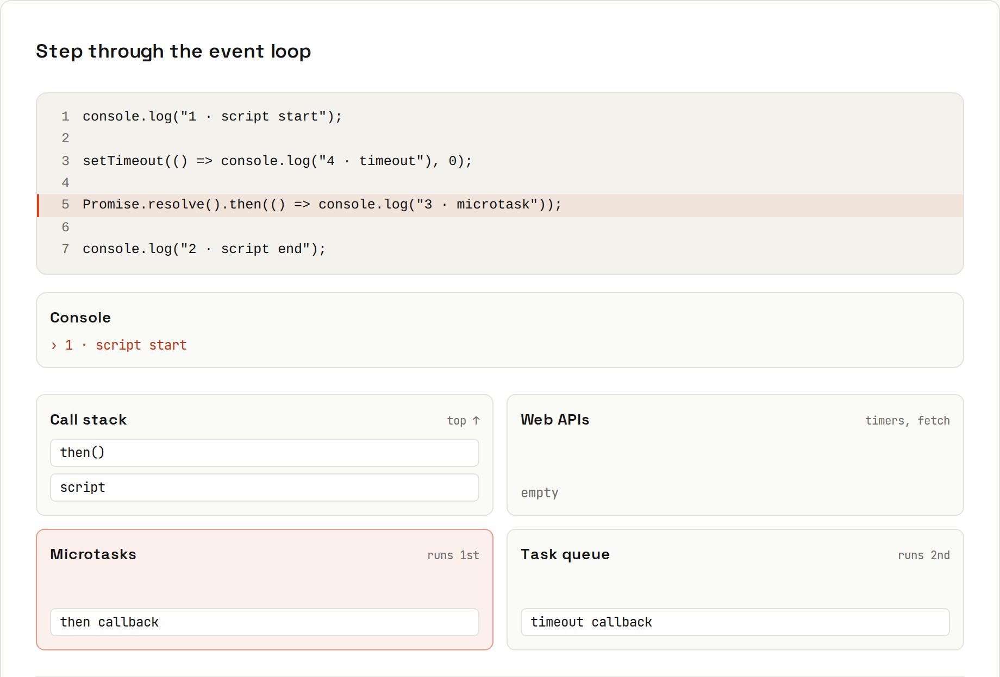
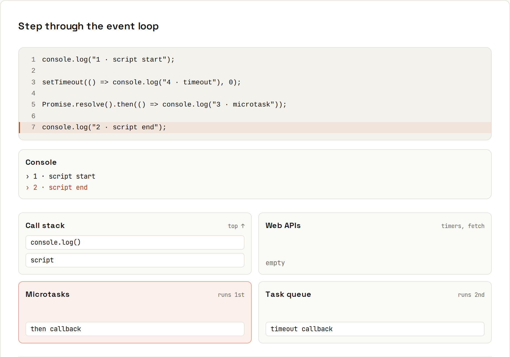
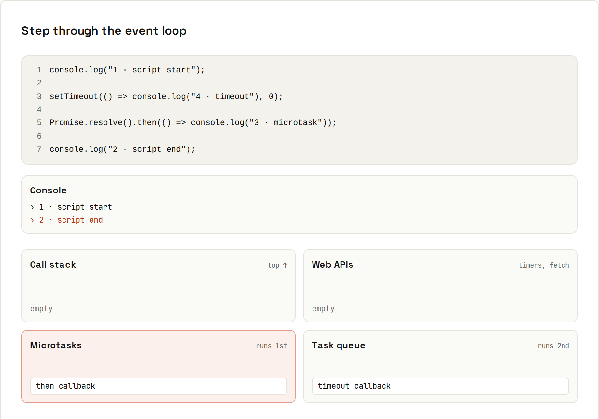
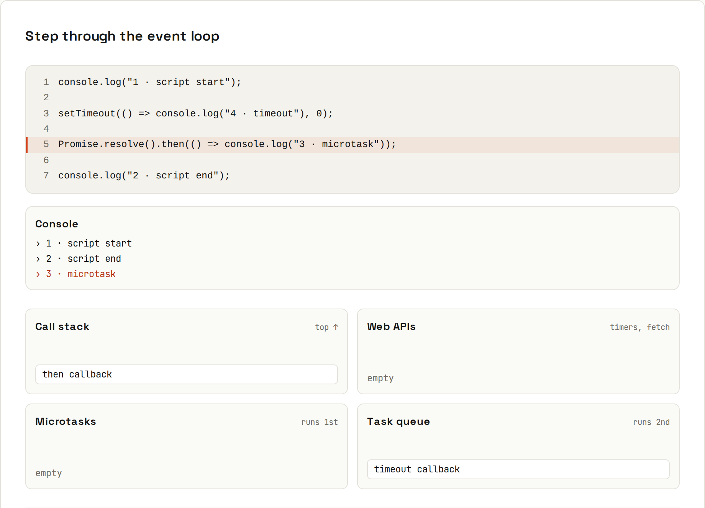
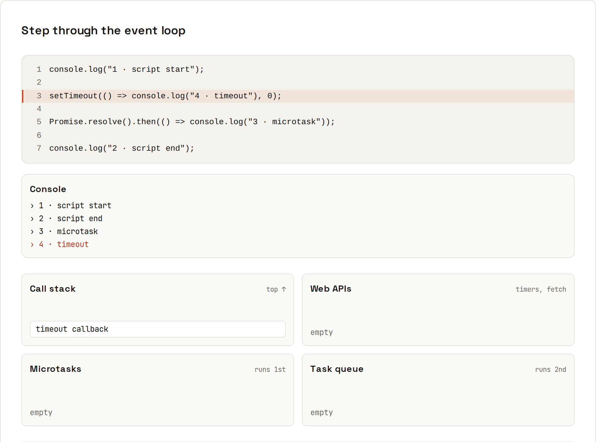

# The Event Loop

**One thread, never blocked: how async code takes turns.** JavaScript runs your code on a single thread. Slow things (timers, network, disk) are handed to the environment, and their callbacks are queued. The rule: **finish all synchronous code, then run every microtask (promises), then one task (timers, events), and repeat.**

## Guess the order
```js
console.log("1 · script start");
setTimeout(() => console.log("4 · timeout"), 0);
Promise.resolve().then(() => console.log("3 · microtask"));
console.log("2 · script end");
```
```
1 · script start
2 · script end
3 · microtask
4 · timeout
```
(`code/javascript/event-loop.mjs`, Node 22; browsers print the same.) Now step through it.

### Step 1 of 8

Synchronous code runs first, top to bottom, on the **call stack**.

### Step 2

`setTimeout` hands its callback to the browser's timer (a **Web API**). Even 0 ms means "later", never "now".

### Step 3

The timer finishes, so the callback moves to the **task queue**, where it must wait for the stack to empty.

### Step 4

The promise is already resolved, so its `.then` callback is queued as a **microtask**.

### Step 5

Still synchronous, so this logs before either callback, even though it's written last.

### Step 6

The script is done and the stack is empty. The event loop now drains **every** microtask before touching the task queue.

### Step 7

The microtask runs first…

### Step 8

…and only then the next task. Final order: 1, 2, 3, 4.

## The parts
| Part | Holds | Examples |
|---|---|---|
| **Call stack** | the functions currently running | your code |
| **Web APIs / Node APIs** | work happening outside JavaScript | timers, `fetch`, file reads, DOM events |
| **Microtask queue** | high-priority callbacks, **all** run after each task | `.then/.catch/.finally`, code after `await`, `queueMicrotask` |
| **Task queue** (macrotasks) | the rest, **one** per loop turn | `setTimeout`, `setInterval`, events, I/O callbacks, `MessageChannel` |
| **Rendering** (browser) | style, layout, paint, between tasks | `requestAnimationFrame` callbacks run before paint |

## A harder one
```js
console.log("A");
setTimeout(() => {
  console.log("B (timer 1)");
  Promise.resolve().then(() => console.log("C (microtask inside timer 1)"));
}, 0);
setTimeout(() => console.log("D (timer 2)"), 0);
queueMicrotask(() => console.log("E (queueMicrotask)"));
Promise.resolve()
  .then(() => console.log("F (then 1)"))
  .then(() => console.log("G (then 2, queued when then 1 finished)"));
(async () => {
  console.log("H (async function runs synchronously until the first await)");
  await null;
  console.log("I (after await = a microtask)");
})();
console.log("J");
```
```
A
H (async function runs synchronously until the first await)
J
E (queueMicrotask)
F (then 1)
I (after await = a microtask)
G (then 2, queued when then 1 finished)
B (timer 1)
C (microtask inside timer 1)
D (timer 2)
```
- `H` prints synchronously: an `async` function runs normally until its first `await`.
- `G` comes after `I`: it's only queued once `F` finishes.
- `C` runs **before** `D`: after each task (timer 1), all microtasks run before the next task (timer 2).

## Never block the loop
```js
const start = Date.now();
setTimeout(() => console.log(`timer fired after ${Date.now() - start} ms (asked for 0)`), 0);
while (Date.now() - start < 300) { /* busy for 300 ms */ }
console.log("loop done");
```
```
loop done
timer fired after 306 ms (asked for 0)
```
While synchronous code runs, **nothing** else happens: no timers, no clicks, no rendering. In a browser the page freezes; in Node every other request waits. Keep work in small pieces, or move heavy computation to a **Web Worker** (browser) / **worker thread** (Node).

## Why it matters
- Explains output order questions (a classic interview topic).
- `setTimeout(fn, 0)` is "after the current work", not "immediately".
- A microtask loop (a `.then` that keeps queueing `.then`s) can starve rendering just like a `while` loop.
- It's why async code needs [[javascript/Promises]] or callbacks: there's no second thread to wait on.

Java solves the same problem with many threads instead ([[java/Concurrency Basics]]); Kotlin coroutines look like JavaScript's `async/await` ([[kotlin/Coroutines]]).
