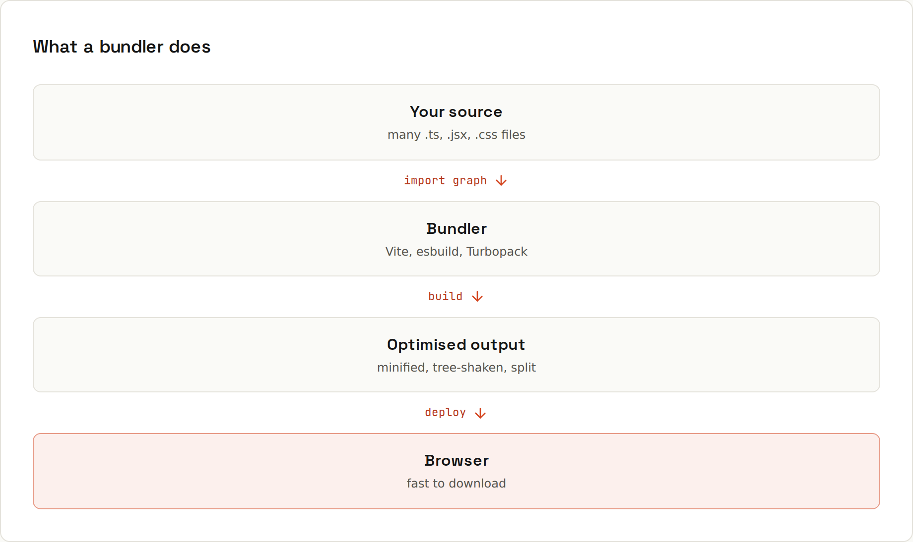

# Tooling

Modern JavaScript projects run through a toolchain before they reach the browser: a **bundler/dev server**, a **linter**, a **formatter**, a **type checker** and a **test runner**.



## What a bundler does
- **Resolves imports** (including npm packages) into a dependency graph.
- **Transforms**: TypeScript → JavaScript, JSX → function calls, modern syntax → what target browsers support, CSS modules, images.
- **Bundles and splits**: fewer, smaller files; separate chunks loaded on demand (`import()`).
- **Optimises**: minification, tree shaking (dropping unused exports), hashed file names for long caching.
- **Dev server**: instant reloads with **hot module replacement** (HMR): edits appear without losing page state.

| Tool | Notes |
|---|---|
| **Vite** | the default for new projects: fast dev server, Rollup-based builds; React, Vue, Svelte templates (`npm create vite@latest`) |
| **Next.js** (Turbopack) | React framework with routing, server rendering and static export (this site) |
| esbuild, Rollup, Rspack, Parcel | bundlers under the hood or for libraries |
| webpack | older projects; still everywhere in enterprise |

## Linting: ESLint
Finds bugs and bad patterns: unused variables, `==` instead of `===`, missing `await`, React hook rule violations.
```js
// eslint.config.js (flat config)
import js from "@eslint/js";
export default [
  js.configs.recommended,
  { rules: { eqeqeq: "error", "no-console": "warn" } },
];
```
```sh
npx eslint .          # check
npx eslint . --fix    # fix what can be fixed
```
With TypeScript: `typescript-eslint`. **Biome** and **oxlint** are much faster alternatives.

## Formatting: Prettier
Formats code automatically so nobody argues about semicolons or quotes. Run on save in the editor and check in CI: `npx prettier --check .`. Formatting and linting are different jobs: let Prettier (or Biome) format, ESLint catch bugs.

## Testing
| Tool | For |
|---|---|
| **Vitest** | unit tests, Jest-compatible API, works with Vite configs |
| Jest | the long-time standard |
| `node --test` | Node's built-in test runner, zero dependencies |
| **Playwright** | end-to-end tests in real browsers (used to verify this guide's DOM examples) |
| Testing Library | test components the way users use them |

```js
// cart.test.js (Vitest)
import { describe, it, expect } from "vitest";
import { total } from "./cart.js";

describe("total", () => {
  it("adds prices times quantities", () => {
    expect(total([{ price: 250, qty: 2 }, { price: 400, qty: 1 }])).toBe(900);
  });
});
```

## Typical scripts
```json
"scripts": {
  "dev": "vite",
  "build": "tsc --noEmit && vite build",
  "preview": "vite preview",
  "lint": "eslint .",
  "format": "prettier --write .",
  "test": "vitest run"
}
```
Run the same commands in CI ([[github/GitHub Actions]]). Editor integration: [[IDEs/Extensions and Plugins]].

## Environment variables
Build tools inject variables at build time: Vite exposes `import.meta.env.VITE_*`, Next.js `process.env.NEXT_PUBLIC_*`. Anything shipped to the browser is **public**: never put secrets in frontend environment variables.
