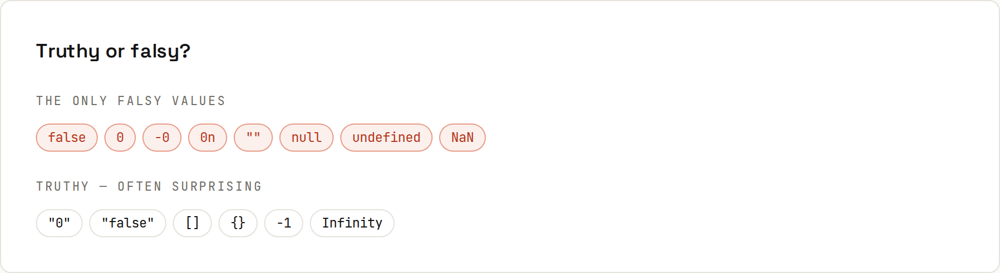

# Types and Equality

JavaScript has seven **primitive** types and objects. Values have types; variables don't. Output from `code/javascript/types.mjs`.

## `typeof`
```
42              number
3.14            number
"hi"            string
true            boolean
null            object  (a famous bug from 1995)
undefined       undefined
10n             bigint
Symbol(id)      symbol
{}              object
[]              object (but Array.isArray says true)
() => {}        function
```
| Type | Notes |
|---|---|
| `number` | one type for integers and decimals (64-bit floating point) ([[javascript/Numbers and Math]]) |
| `bigint` | arbitrary-size integers: `10n` |
| `string` | immutable text ([[javascript/Strings]]) |
| `boolean` | `true` / `false` |
| `undefined` | "no value assigned": missing properties, missing arguments, functions without `return` |
| `null` | "intentionally empty" |
| `symbol` | unique keys, mostly for libraries |
| `object` | everything else: objects, arrays, functions, dates, maps… |

Check arrays with `Array.isArray(x)`, null with `x === null`, "null or undefined" with `x == null` (the one accepted use of `==`) or `x ?? fallback`.

## `==` vs `===`
`==` converts types before comparing; `===` never does.
```
0 == "":                 true   === false
"1" == 1:                true   === false
null == undefined:       true   === false
NaN == NaN:              false  === false
[] == false:             true   === false
"0" == false:            true   === false
Number.isNaN(NaN): true  Object.is(NaN, NaN): true
```
**Always use `===` and `!==`.** ESLint's `eqeqeq` rule flags `==`. `NaN` is the only value not equal to itself: test it with `Number.isNaN`. Objects (including arrays) are compared by **reference**: `[1] === [1]` is `false`.

## Truthy and falsy


In `if (x)`, `&&`, `||` and `!`, values are converted to booleans. Exactly these are **falsy**:
```
false -> false
0 -> false
-0 -> false
0n -> false
"" -> false
null -> false
undefined -> false
NaN -> false
```
Everything else is truthy, including some surprises:
```
"0" -> true
"false" -> true
" " -> true
[] -> true
{} -> true
-1 -> true
Infinity -> true
```
Classic bug: `if (items.length)` is fine, but `if (count)` is false for a legitimate `0`. Use `??` instead of `||` for defaults ([[javascript/Objects]]).

## Implicit conversion
```
"5" + 3 = 53 | "5" - 3 = 2 | "5" * "2" = 10 | [] + [] = "" | [] + {} = [object Object]
Number("42px") = NaN | parseInt("42px") = 42 | Number("") = 0 | +true = 1
```
`+` concatenates if either side is a string; other arithmetic operators convert to numbers. Convert **explicitly** instead: `Number(input)`, `String(n)`, `Boolean(x)`, and validate (`Number.isFinite(n)`). Form fields and URL parameters are always strings.

## Copy by value vs by reference
Primitives are copied; objects are shared (like Java references: [[java/References and Memory]]). Copying objects: [[javascript/Objects]].

## TypeScript
Static types catch most of these mistakes before running: [[javascript/TypeScript]].
