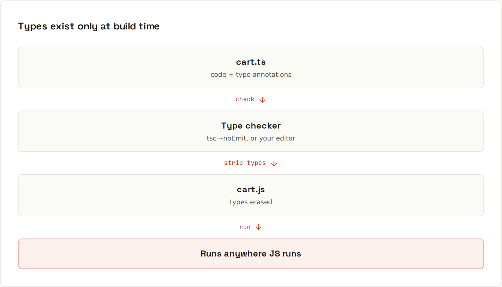

# TypeScript

**TypeScript catches the bug before the user does.** It adds a type layer on top of JavaScript: it checks your code while you type and in CI, then strips the types away. What runs is plain JavaScript. Everything below was checked with **tsc 5.9** (`code/javascript/typescript/`).



## The types you'll use most
```ts
type Status = "idle" | "loading" | "error";   // union of literals

interface User {
  id: number;
  name: string;
  email?: string;                             // optional
}

function greet(user: User): string {
  return `Hi ${user.name}`;
}

function first<T>(items: T[]): T | undefined { // generic
  return items[0];
}

// narrowing: TypeScript follows your checks
function show(value: string | number): string {
  if (typeof value === "string") return value.toUpperCase();
  return value.toFixed(2);
}
```
This file compiles without errors and runs:
```
loading Hi Ada 3 TS 3.14 Declined: card expired { email: 'ada@example.com' } { id: 1, name: 'Ada' } { tea: 250 }
unknown narrowed: Ada
```

## What it catches
```ts
const user: User = { id: 1, name: "Ada" };
user.nmae = "Grace";                          // typo
const id: number = "42";                      // wrong type
greet({ id: 2 });                             // missing field
console.log(user.email.toLowerCase());        // might be undefined
const scores = [90, 72];
const firstScore: number = scores[0];         // noUncheckedIndexedAccess: might be undefined
total(["1", "2"]);                            // wrong element type
```
```sh
npx tsc --noEmit
```
```
src/mistakes.ts(4,6): error TS2339: Property 'nmae' does not exist on type 'User'.
src/mistakes.ts(5,7): error TS2322: Type 'string' is not assignable to type 'number'.
src/mistakes.ts(6,7): error TS2345: Argument of type '{ id: number; }' is not assignable to parameter of type 'User'.
  Property 'name' is missing in type '{ id: number; }' but required in type 'User'.
src/mistakes.ts(7,13): error TS18048: 'user.email' is possibly 'undefined'.
src/mistakes.ts(9,7): error TS2322: Type 'number | undefined' is not assignable to type 'number'.
  Type 'undefined' is not assignable to type 'number'.
src/mistakes.ts(13,8): error TS2322: Type 'string' is not assignable to type 'number'.
src/mistakes.ts(13,13): error TS2322: Type 'string' is not assignable to type 'number'.
```
Every one of these would have been a runtime bug in plain JavaScript, most of them silent.

## Discriminated unions
The TypeScript version of sealed types ([[java/Sealed Types]]):
```ts
type Result =
  | { kind: "paid"; transactionId: string }
  | { kind: "declined"; reason: string };

function message(r: Result): string {
  switch (r.kind) {
    case "paid": return `Paid (${r.transactionId})`;
    case "declined": return `Declined: ${r.reason}`;
  }
}
```
Inside each `case`, TypeScript knows which fields exist. Add a third kind and the function stops compiling (it no longer returns a string on every path).

## Utility types
| Utility | Gives you |
|---|---|
| `Partial<User>` | all fields optional: great for updates |
| `Required<User>` | all fields required |
| `Pick<User, "id" \| "name">` | only those fields |
| `Omit<User, "email">` | everything except those |
| `Record<string, number>` | an object map of keys to values |
| `ReturnType<typeof fn>` | whatever a function returns |
| `Readonly<T>` | no reassigning properties |
| `Awaited<Promise<T>>` | `T` |

## `any` vs `unknown`
`any` switches type checking off: errors slip through silently. `unknown` means "I don't know yet" and forces you to check before using it:
```ts
function parse(json: string): unknown { return JSON.parse(json); }
const data = parse('{"name":"Ada"}');
if (typeof data === "object" && data !== null && "name" in data) console.log("unknown narrowed:", data.name);
```
Use `unknown` for data from APIs and `JSON.parse`, and validate it (Zod: [[javascript/JSON]]).

## tsconfig.json: turn on strict
```json
{
  "compilerOptions": {
    "strict": true,
    "noUncheckedIndexedAccess": true,
    "target": "ES2022",
    "module": "NodeNext",
    "outDir": "dist"
  },
  "include": ["src"]
}
```
`strict` enables null checks and much more; `noUncheckedIndexedAccess` makes `array[i]` possibly `undefined` (it usually can be).

## Running TypeScript
- In a Vite/Next.js project: just use `.ts`/`.tsx` files; the bundler strips types, and `tsc --noEmit` (in CI and your editor) checks them.
- Node 22.18+/23.6+ can run `.ts` files directly (type stripping); Deno and Bun always could.
- Libraries ship `.d.ts` type definitions; for packages without them, `npm i -D @types/<name>`.

## Coming from Java or Kotlin
- Types are **structural**: anything with the right shape fits an interface; no `implements` needed.
- Types don't exist at runtime: no `instanceof User` for interfaces; check fields instead.
- `null` and `undefined` are separate; `strict` makes you handle both, similar to Kotlin's nullable types ([[kotlin/Null Safety]]).
