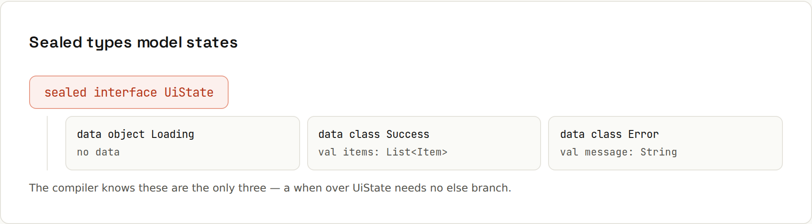

# Classes and Objects

**Nine kinds of class, each with a clear job.** Kotlin classes are final by default, and properties replace fields plus getters and setters. Pick the kind of class that says what you mean. Output from `code/kotlin/src/main/kotlin/Classes.kt`.

| Kind | Job |
|---|---|
| `class` | regular class; **final** by default, can't be extended |
| `open class` | explicitly allows subclasses |
| `abstract class` | can't be instantiated; subclasses fill in the gaps |
| `data class` | holds data: `equals`, `hashCode`, `toString`, `copy`, `componentN` |
| `sealed class` / `sealed interface` | a closed set of subtypes known at compile time |
| `enum class` | a fixed list of constants, each can have properties |
| `object` | a singleton: exactly one instance, created lazily |
| `companion object` | class-level members, like Java's `static` |
| `value class` | wraps one value with type safety and no runtime overhead |

## A regular class
```kotlin
class Account(val owner: String, initialBalance: Double = 0.0) {
    var balance = initialBalance
        private set                       // readable outside, writable only inside

    init {
        require(initialBalance >= 0) { "balance can't be negative" }
    }

    val isEmpty: Boolean get() = balance == 0.0   // computed property

    fun deposit(amount: Double) { balance += amount }

    companion object {
        fun demo() = Account("demo", 100.0)       // Account.demo()
    }
}
```
```
Ada: 75.0, empty=false, demo=100.0
init: balance can't be negative
```
- The **primary constructor** is in the class header; `val`/`var` parameters become properties.
- `init` blocks run during construction (validation).
- Secondary constructors (`constructor(...) : this(...)`) are rarely needed thanks to default arguments.

## Sealed types model states

```kotlin
sealed interface UiState {
    data object Loading : UiState
    data class Success(val items: List<String>) : UiState
    data class Error(val message: String) : UiState
}

fun render(state: UiState) = when (state) {
    UiState.Loading -> "spinner"
    is UiState.Success -> "list of ${state.items.size}"   // smart cast
    is UiState.Error -> "error: ${state.message}"
}   // add a 4th state and this stops compiling, on purpose
```
```
[spinner, list of 2, error: offline]
Loading
```
Forget a case and the compiler tells you:
```
e: Broken.kt:24:32 'when' expression must be exhaustive. Add the 'is Done' branch or an 'else' branch.
```
`data object` gives a singleton a nice `toString()` (`Loading` instead of `UiState$Loading@1a2b3c`). Same idea as Java's sealed interfaces + records ([[java/Sealed Types]]).

## object and companion object
```kotlin
object Config {                                   // singleton
    val apiUrl = "https://api.example.com"
    init { println("  Config initialised on first use") }
}
println("before Config"); println(Config.apiUrl); println(Config.apiUrl)
```
```
before Config
  Config initialised on first use
https://api.example.com
https://api.example.com
```
Thread-safe and lazy. `object : Comparator<User> { … }` creates an anonymous object (like Java's anonymous classes).

## value classes
```kotlin
@JvmInline
value class Email(val value: String) {             // type-safe, zero overhead
    init { require("@" in value) { "not an e-mail: $value" } }
}
```
```
Email(value=ada@example.com)
not an e-mail: nope
```
`fun send(to: Email, from: Email)` can't be called with a random `String` or with arguments swapped from different types (`UserId` vs `OrderId`), yet at runtime it's just a `String`.

## enum class
```kotlin
enum class Size(val ml: Int) { SMALL(250), MEDIUM(400), LARGE(500) }
```
```
MEDIUM 400 ml, entries=[SMALL, MEDIUM, LARGE], valueOf=LARGE
```
`Size.entries` (Kotlin 1.9+) replaces `values()`.

## Inheritance
```kotlin
open class Animal(val name: String) {
    open fun sound() = "..."
    override fun toString() = "$name says ${sound()}"
}
class Dog(name: String) : Animal(name) {
    override fun sound() = "woof"
}
abstract class Shape { abstract fun area(): Double }
class Circle(private val r: Double) : Shape() { override fun area() = Math.PI * r * r }
```
```
Rex says woof / Generic says ... / area 3.14
```
`open` on the class and on each overridable member, `override` is mandatory. Extending a final class:
```
e: Broken.kt:29:15 This type is final, so it cannot be extended.
```

## Visibility
`public` (default), `private` (file or class), `protected` (subclasses), `internal` (the same module, e.g. one Gradle project). No package-private.

## Deeper
Interfaces with default methods, delegation (`class Logger(w: Writer) : Writer by w`), nested vs inner classes, and more: [Kotlin wiki: classes](https://lfdiego.xyz/wiki/kotlin/wiki/classes).
