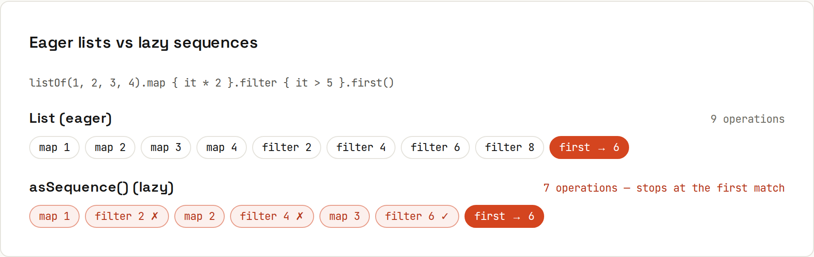

# Collection Operations

**A standard library that does the loop for you.** Kotlin collections come with dozens of operations, directly on the collection (no `.stream()`). Lists are **eager**: each step builds a whole new list. **Sequences** are lazy, like Java streams. Output from `code/kotlin/src/main/kotlin/Collections.kt`.

## The operations
| Operation | Example | Result |
|---|---|---|
| `map` | `listOf(1, 2, 3).map { it * 10 }` | `[10, 20, 30]` |
| `filter` | `listOf(1, 2, 3, 4).filter { it % 2 == 0 }` | `[2, 4]` |
| `flatMap` | `listOf("a b", "c").flatMap { it.split(" ") }` | `[a, b, c]` |
| `groupBy` | `words.groupBy { it.first() }` | `{a=[apple, avocado], b=[banana]}` |
| `associateBy` | `users.associateBy { it.id }` | `{1=Person(id=1, name=Ada), 2=Person(id=2, name=Bo)}` |
| `partition` | `nums.partition { it > 0 }` | `([3, 4], [-1, -5])` |
| `zip` | `listOf(1, 2).zip(listOf("a", "b"))` | `[(1, a), (2, b)]` |
| `chunked` | `(1..5).toList().chunked(2)` | `[[1, 2], [3, 4], [5]]` |
| `windowed` | `(1..4).toList().windowed(2)` | `[[1, 2], [2, 3], [3, 4]]` |
| `fold` | `nums.fold(0) { acc, n -> acc + n }` | `1` |
| `sumOf` / `maxByOrNull` | `orders.sumOf { it.total }` | `54.989999999999995` |

All results above are real output (with `nums = [3, -1, 4, -5]`). Note the `sumOf` result: three prices as `Double` don't add up exactly. Use `Long` cents or `BigDecimal` for money ([[java/Primitive Types]]).

## Chains
```kotlin
orders.groupBy { it.customer }.mapValues { (_, os) -> os.sumOf { it.total } }
orders.sortedByDescending { it.total }.map { it.id }
```
```
per customer {Ada=49.989999999999995, Bo=5.0}
sortedBy   [3, 1, 2], distinct [1, 2], take [3, -1], drop [-5]
any/all/none/count true true true 2
first/firstOrNull 4 null, find -1
joinToString [APPLE, AVOCADO, BANANA]
```
Other favourites: `sortedBy`, `sortedWith(compareBy({ it.city }, { it.name }))`, `distinctBy`, `maxOf`, `minByOrNull`, `sumOf`, `average`, `count { }`, `take/drop/takeWhile`, `firstOrNull { }`, `last()`, `single()`, `withIndex()`, `forEachIndexed`, `mapIndexed`, `mapNotNull`, `filterIsInstance<T>()`, `flatten()`, `associate { it.id to it.name }`, `toSet()`, `toMutableList()`.

`first { }` throws if nothing matches (`NoSuchElementException`); `firstOrNull { }` returns `null`. Prefer the `OrNull` variants plus `?:`.

## Eager lists vs lazy sequences

```kotlin
listOf(1, 2, 3, 4).map { it * 2 }.filter { it > 5 }.first()
listOf(1, 2, 3, 4).asSequence().map { it * 2 }.filter { it > 5 }.first()
```
With a `println` in each step:
```
--- eager list vs lazy sequence
  map 1
  map 2
  map 3
  map 4
  filter 2
  filter 4
  filter 6
  filter 8
  eager result 6
  map 1
  filter 2
  map 2
  filter 4
  map 3
  filter 6
  lazy result 6
```
The list version maps **everything**, builds a list, filters **everything**, builds another list, then takes the first. The sequence processes one element at a time and stops as soon as it has an answer: 6 operations instead of 8, and no intermediate lists.

### When to use a sequence
For small lists, plain list operations are simplest and fast. Switch to `asSequence()` for long chains over large collections, when you stop early (`first`, `take`), or for infinite generators:
```kotlin
generateSequence(1) { it * 3 }.takeWhile { it < 100 }.toList()
```
```
generateSequence: [1, 3, 9, 27, 81]
```
Like Java streams, sequences only run when a terminal operation (`toList`, `first`, `sum`, `forEach`) asks. Unlike streams, they can be iterated again.
