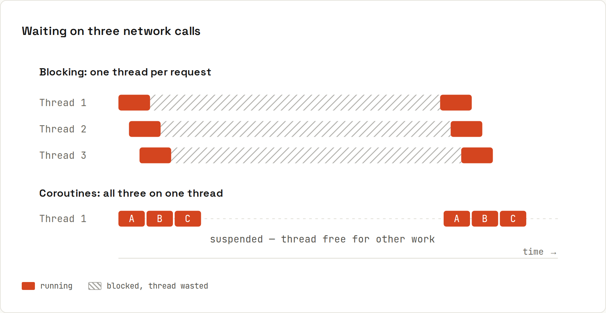

# Coroutines

**Suspend instead of block: many tasks, few threads.** A `suspend` function can pause while it waits (for the network, a database, a timer) and hand its thread back. Thousands of coroutines can share a handful of threads. Output from `code/kotlin/src/main/kotlin/Coroutines.kt` (kotlinx.coroutines 1.11.0).



## Setup
```kotlin
dependencies { implementation("org.jetbrains.kotlinx:kotlinx-coroutines-core:1.11.0") }
```
`suspend` is part of the language; builders like `launch`, `async`, `delay`, `Flow` come from the **kotlinx.coroutines** library.

## Two requests at once
```kotlin
object Api {
    suspend fun user(): String { delay(100); return "Ada" }
    suspend fun orders(): Int { delay(150); return 3 }
}

suspend fun loadDashboard(): Dashboard = coroutineScope {
    val user = async { Api.user() }      // starts now
    val orders = async { Api.orders() }  // runs concurrently
    Dashboard(user.await(), orders.await())
}
```
```
Dashboard(user=Ada, orders=3)
sequential ~250 ms, concurrent ~150 ms
```
The code reads top to bottom like blocking code, but runs concurrently, with no callbacks and no `CompletableFuture` chains.

## Starting coroutines
| Builder | Returns | Use for |
|---|---|---|
| `runBlocking { }` | the result | bridge from normal code (`main`, tests); **blocks** the thread |
| `launch { }` | `Job` | fire-and-forget work: save, log, update UI |
| `async { }` | `Deferred<T>` | work with a result, read with `await()` |
| `coroutineScope { }` | the result | group children inside a suspend function ([[kotlin/Structured Concurrency]]) |
| `withContext(Dispatchers.IO) { }` | the result | switch threads for a block |

A `suspend` function can only be called from another `suspend` function or a coroutine:
```
e: Broken.kt:14:5 Suspend function 'suspend fun delay(timeMillis: Long): Unit' can only be called from a coroutine or another suspend function.
```

## Cancellation
```kotlin
val job = launch {
    repeat(10) { i -> println("working $i"); delay(40) }
}
delay(100)
job.cancelAndJoin()
```
```
working 0
working 1
working 2
job cancelled: true
```
Suspending functions like `delay` check for cancellation; the job stops at the next suspension point.

## Cheap
```kotlin
coroutineScope { repeat(100_000) { launch { delay(1000) } } }
```
```
100,000 coroutines each waiting 1 s: 1500 ms total
```
100,000 platform threads would need gigabytes of stack memory. (Java's virtual threads now offer similar scale for blocking code: [[java/Virtual Threads and Executors]].)

## Timeouts and dispatchers
```kotlin
val result = withTimeoutOrNull(200) { delay(1000); "too slow" }     // null
val thread = withContext(Dispatchers.IO) { Thread.currentThread().name }
```
```
withTimeoutOrNull: null
withContext(Dispatchers.IO) ran on DefaultDispatcher-worker-1
```
| Dispatcher | Runs on | Use for |
|---|---|---|
| `Dispatchers.Main` | the UI thread | updating views (Android, desktop) |
| `Dispatchers.IO` | a large shared pool | blocking I/O: files, JDBC, legacy APIs |
| `Dispatchers.Default` | one thread per CPU core | CPU-heavy work: parsing, sorting |

## Where coroutines start
On Android, launch them in `viewModelScope` or `lifecycleScope` so they're cancelled automatically when the screen goes away. On servers, frameworks provide the scope (Ktor handlers and Spring WebFlux controllers can be `suspend` functions). Avoid `GlobalScope`: its coroutines live forever and nobody cancels them.

## Compared with JavaScript
`suspend` + `async/await` looks like JavaScript's `async/await` ([[javascript/Async and Await]]), with two key differences: Kotlin can run on many threads, and coroutines are **structured**: children can't outlive their scope. Next: [[kotlin/Structured Concurrency]].

Deeper: [Kotlin wiki: coroutines](https://lfdiego.xyz/wiki/kotlin/wiki/advanced/coroutines).
