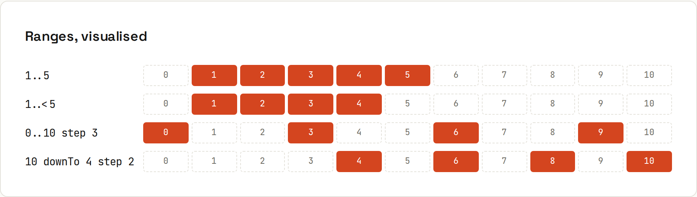

# Expressions and Ranges

**`if`, `when` and `try` all return values.** In Kotlin most control flow is an expression, so you assign its result instead of declaring a variable and filling it in later. Ranges make loops and checks read naturally. Output from `code/kotlin/src/main/kotlin/Expressions.kt`.

## `if` and `when` as expressions
```kotlin
val max = if (a > b) a else b

fun size(count: Int) = when (count) {
    0 -> "empty"
    in 1..9 -> "small"
    in 10..99 -> "medium"
    else -> "large"
}

fun describe(value: Any?): String = when (value) {
    is String -> "text of length ${value.length}"   // smart cast
    is Int -> "number"
    null -> "nothing"
    else -> "something else"
}
```
```
max=7, sizes: empty small medium large
[text of length 2, number, nothing, something else]
```
- `when` branches can be values, ranges (`in 1..9`), types (`is String`), or arbitrary conditions (`when { x > 0 -> … }`).
- After `is String`, the value **is** a `String` in that branch: a **smart cast**.
- As an expression, `when` must be exhaustive: `else`, or all cases of an enum/sealed type ([[kotlin/Classes and Objects]]).
- An `if` used as an expression needs an `else`:
```
e: Broken.kt:17:13 'if' must have both main and 'else' branches when used as an expression.
```

## `try` as an expression
```kotlin
val port = try { input.toInt() } catch (e: NumberFormatException) { 8080 }
```
```
port = 8080, or with toIntOrNull: 8080
```
For parsing, `input.toIntOrNull() ?: 8080` is even shorter.

## Ranges


```kotlin
for (i in 1..3) print(i)              // 1..3: both ends included
for (i in 0..<3) print(i)             // up to, not including
for (i in 10 downTo 0 step 3) print("$i ")
for ((index, item) in list.withIndex()) println("$index: $item")
if (age in 13..19) println("teenager")
repeat(2) { println("hi $it") }
```
```
123
012
10 7 4 1 
0: tea
1: cake
teenager
hi 0
hi 1
'c' in 'a'..'e': true, (1..10).sum() = 55, (1..10 step 4).toList() = [1, 5, 9]
```
| Range | Contains |
|---|---|
| `1..5` | 1, 2, 3, 4, 5 |
| `1..<5` (or `1 until 5`) | 1, 2, 3, 4 |
| `5 downTo 1` | 5, 4, 3, 2, 1 |
| `0..10 step 3` | 0, 3, 6, 9 |
| `'a'..'z'` | characters |
| `list.indices` | `0..<list.size` |

## Labels
```kotlin
outer@ for (x in 1..3) {
    for (y in 1..3) {
        if (y == 2) continue@outer
        if (x == 3) break@outer
        print("($x,$y) ")
    }
}
```
```
(1,1) (2,1) <- labels
```
Labels also say which lambda a `return@forEach` returns from.

## Everything is an expression, almost
Assignments (`x = 5`) are not expressions in Kotlin (so `if (x = 5)` can't happen). `throw` is an expression of type `Nothing`, which is why `val name = input ?: throw IllegalArgumentException("…")` works ([[kotlin/Null Safety]]).
