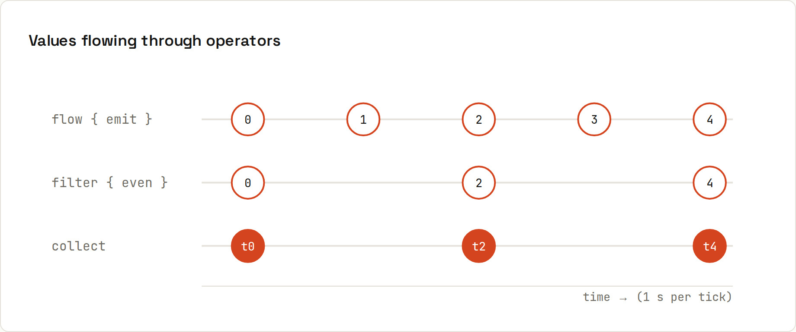

# Flow

**Flow is a stream of values over time.** Where a suspend function returns one value, a `Flow` emits many: sensor readings, search results as you type, database updates. Operators transform the stream; `collect` starts it. Output from `code/kotlin/src/main/kotlin/Flows.kt`.



## Building and collecting a flow
```kotlin
fun ticker(): Flow<Int> = flow {
    var i = 0
    while (true) {
        emit(i++)
        delay(100)
    }
}

ticker()
    .filter { it % 2 == 0 }
    .map { "tick $it" }
    .take(3)
    .collect { println(it) }     // tick 0, tick 2, tick 4
```
```
tick 0
tick 2
tick 4
```
An infinite flow is fine: `take(3)` cancels it after three values.

## Cold by default
```kotlin
val cold = flow { println("  flow started"); emit(1); emit(2) }
println("collect twice: ${cold.toList()} ${cold.toList()}")
```
```
  flow started
  flow started
collect twice: [1, 2] [1, 2]
```
A flow's code runs **per collector**, from the start, like calling a function. Nothing happens until someone collects.

## Search-as-you-type
```kotlin
val queries = flow {
    emit("k"); delay(50); emit("ko"); delay(50); emit("kot"); delay(400)
    emit("kotlin"); delay(400); emit("kotlin")
}
queries
    .debounce(300)
    .distinctUntilChanged()
    .flatMapLatest { q -> flow { delay(100); emit("results for '$q'") } }
    .collect { println(it) }
```
```
results for 'kot'
results for 'kotlin'
```
- `debounce(300)`: only values followed by 300 ms of silence ("k" and "ko" are dropped).
- `distinctUntilChanged()`: the second "kotlin" doesn't trigger a new search.
- `flatMapLatest`: a new query cancels the previous, still-running search.

## StateFlow and SharedFlow
```kotlin
val state = MutableStateFlow("idle")
launch { state.collect { println("  state: $it") } }
state.value = "loading"; state.value = "loading"; state.value = "done"
```
```
  state: idle
  state: loading
  state: done
StateFlow current value: done
```
The duplicate "loading" is **conflated**: a `StateFlow` only emits changes. A `SharedFlow` emits every event:
```
  event: clicked
  event: clicked
```
| | `Flow` | `StateFlow` | `SharedFlow` |
|---|---|---|---|
| Hot or cold | cold: runs per collector | hot | hot |
| Has a current value | no | yes, always (`.value`) | optional replay |
| Repeats equal values | yes | no: conflated | yes |
| Typical use | one-off data pipelines | UI state | one-time events (navigation, toasts) |

## Combining and errors
```kotlin
combine(flowOf(1, 2), flowOf("a")) { n, s -> "$n$s" }.toList()
flowOf(1, 2, 3).zip(flowOf("a", "b")) { n, s -> "$n$s" }.toList()
flow { emit(1); throw IllegalStateException("sensor offline") }
    .catch { e -> emit(-1).also { println("  caught ${e.message}") } }
    .collect { println("  value $it") }
```
```
combine: [1a, 2a], zip: [1a, 2b]
  value 1
  value -1
  caught sensor offline
```
`catch` handles errors from **upstream** operators and can emit a fallback. Other useful operators: `onEach`, `onStart`, `onCompletion`, `retry`, `buffer`, `conflate`, `flowOn(Dispatchers.IO)`, `stateIn`, `shareIn`.

## Where flows come from
Room and SQLDelight queries return `Flow<List<T>>` that re-emit when the table changes; Android's DataStore, Ktor's WebSockets, and `callbackFlow { }` for wrapping listener-based APIs.

Deeper: [Kotlin wiki: Flow](https://lfdiego.xyz/wiki/kotlin/wiki/advanced/flow).
