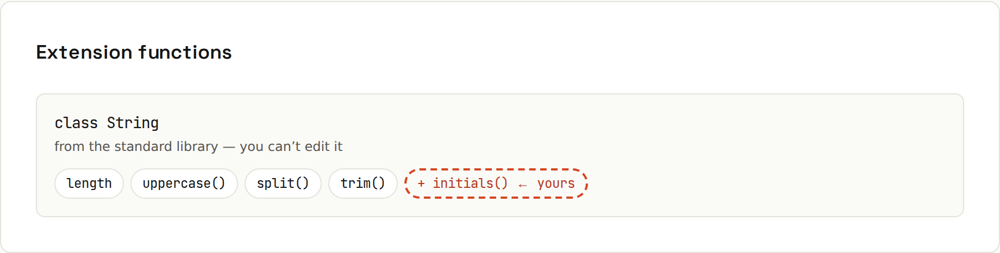

# Functions

**Functions are short, flexible and first-class.** Default and named arguments replace most overloads. Lambdas and trailing-lambda syntax make APIs read like a language of their own. Extension functions add methods to classes you don't own. Output from `code/kotlin/src/main/kotlin/Functions.kt`.

## Parameters: defaults, names, varargs
```kotlin
fun connect(host: String, port: Int = 443, secure: Boolean = true) =
    "${if (secure) "https" else "http"}://$host:$port"

connect("example.com")                             // defaults fill in
connect("localhost", secure = false, port = 8080)  // named: any order
fun sum(vararg numbers: Int) = numbers.sum()
sum(1, 2, 3) + sum(*intArrayOf(4, 5))              // spread an array with *
```
```
https://example.com:443
http://localhost:8080
15
```
Named arguments make calls with several booleans or numbers readable (`createUser(name = "Ada", admin = false)`).

## Lambdas and higher-order functions
```kotlin
// higher-order function: takes a function as a parameter
fun repeatTimes(times: Int, action: (Int) -> Unit) {
    for (i in 0 until times) action(i)
}

repeatTimes(3) { i -> println("round $i") }    // trailing lambda
val double: (Int) -> Int = { it * 2 }          // 'it' = single parameter
listOf(1, 2, 3).map(double)                    // [2, 4, 6]
```
```
round 0
round 1
round 2
[2, 4, 6]
```
- Function types: `(Int) -> Unit`, `(String, Int) -> Boolean`, `() -> String`.
- If the **last** parameter is a function, the lambda goes outside the parentheses (**trailing lambda**); if it's the only parameter, the parentheses disappear: `list.forEach { println(it) }`.
- `it` is the implicit name of a single parameter.
- The last expression in a lambda is its return value.
- Function references: `::localHelper`, `String::length`, `user::save`.

## Extension functions

```kotlin
fun String.initials(): String =
    split(" ")
        .filter { it.isNotBlank() }
        .joinToString("") { it.first().uppercase() }

val String.isPalindrome: Boolean get() = this == reversed()   // extension property

"Ada Lovelace".initials()   // "AL"
```
Most of Kotlin's standard library (`map`, `filter`, `let`, `toIntOrNull`) is extension functions on Java's classes.

> **Extensions don't really change the class.** They compile to static functions that take the object as the first parameter, so they can't access private members and aren't overridden by subclasses. They only exist where they're imported.

## Infix functions
```kotlin
infix fun Int.percentOf(total: Int) = total * this / 100
20 percentOf 250   // 50
```
Also in the standard library: `"tea" to 250` (creates a `Pair`), `1 until 10`, `x shl 2`.

## Closures
```kotlin
fun makeCounter(): () -> Int {
    var count = 0
    return { ++count }
}
```
```
1 2 3
```
Unlike Java lambdas, Kotlin lambdas can modify captured `var`s.

## Inline functions
```kotlin
inline fun <T> measure(label: String, block: () -> T): T {
    val start = System.nanoTime()
    return block().also { println("$label took ${(System.nanoTime() - start) / 1_000_000} ms") }
}
val sorted = measure("sorting") { (1..200_000).shuffled().sorted() }
```
```
sorting took 152 ms
```
`inline` copies the function body and the lambda into the call site: no lambda object, and `return` inside the lambda returns from the outer function. Standard functions like `map`, `filter`, `let` are inline. `reified` type parameters need `inline` ([[kotlin/Generics]]).

## Local functions
```kotlin
fun localHelper(x: Int) = x * x                               // inside another function
listOf(1, 2, 3).map(::localHelper) + listOf("a", "bb").map(String::length)
```
```
[1, 4, 9, 1, 2]
```

## Single-expression functions
```kotlin
fun isAdult(age: Int) = age >= 18
```
Prefer them for anything that fits on a line. Public API functions often still declare the return type explicitly.
