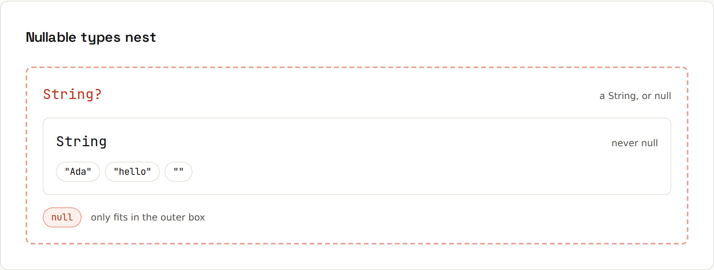

# Null Safety

**The type system knows what can be null.** `String` and `String?` are different types. The compiler won't let you call `.length` on something that might be null until you've handled that case. Output from `code/kotlin/src/main/kotlin/NullSafety.kt`.



## The compiler stops you
```kotlin
var nickname: String? = null
nickname.length            // doesn't compile
```
```
e: Broken.kt:9:23 Only safe (?.) or non-null asserted (!!.) calls are allowed on a nullable receiver of type 'String?'.
```
Assigning `null` to a non-null type doesn't compile either:
```
e: Broken.kt:15:21 Null cannot be a value of a non-null type 'String'.
```

## The operators
| Operator | If it has a value | If it's null |
|---|---|---|
| `a?.length` | the length | `null` |
| `a ?: "none"` | `a` | `"none"` (the **Elvis** operator) |
| `a?.let { … }` | runs the block | skips it |
| `a!!.length` | the length | throws `NullPointerException`: avoid |
| `if (a != null)` | `a` is a `String` inside | – |

```kotlin
println(nickname?.length)            // null
println(nickname?.length ?: 0)       // 0
nickname = "Ada"
if (nickname != null) println("smart cast: ${nickname.length}")
nickname?.let { println("let runs for $it") }
```
```
null
0
smart cast: 3
let runs for Ada
```

## Safe call chains
```kotlin
data class Address(val city: String?)
data class Customer(val name: String, val address: Address?)
println("${ada.address?.city ?: "unknown"} / ${bo.address?.city ?: "unknown"}")
```
```
London / unknown
```
The Java equivalent is a ladder of `if (x != null)` or `Optional.map` calls ([[java/Optional]]).

## Elvis with `throw` or `return`
```kotlin
val name = input ?: "guest"
fun requireName(n: String?): String = n ?: throw IllegalArgumentException("name is required")
fun process(order: Order?) { val o = order ?: return; … }   // early exit
```
```
name = guest
elvis + throw: name is required
```

## `!!`: the "I promise" operator
```kotlin
val maybe: String? = null
maybe!!.length
```
```
!! threw NullPointerException
```
Every `!!` is a potential crash and a code smell. Acceptable in tests, or right after a check the compiler can't see. Usually `?:`, `?.let`, `requireNotNull(x) { "message" }` or `checkNotNull` are better: they fail with a message.

## Collections with nulls
```kotlin
val mixed: List<String?> = listOf("a", null, "b")
mixed.filterNotNull()                                // [a, b]
listOf("1", "x", "3").mapNotNull { it.toIntOrNull() } // [1, 3]
mixed.map { it?.length ?: 0 }                        // [1, 0, 1]
```
`List<String?>` (a list that may contain nulls) and `List<String>?` (a list that may itself be null) are different types.

## Nulls from Java
Java methods don't say whether they return null, so Kotlin sees a **platform type** `String!`: it lets you treat it as either. Decide at the boundary:
```kotlin
println("System.getenv(\"NOPE\") = ${System.getenv("NOPE")}")  // a Java method that returns null
```
```
System.getenv("NOPE") = null
```
Assign Java results to `String?` unless you're sure. If you assign `null` to a non-null type, Kotlin fails **immediately** with a clear message instead of somewhere later ([[kotlin/Java Interop]]).

## `lateinit` and `lazy`
For non-null properties initialised later (dependency injection, test setup): `lateinit var token: String`. Reading it too early throws `lateinit property token has not been initialized`. For values computed on first use: `val config by lazy { load() }`. → [[kotlin/Properties and Delegation]]
