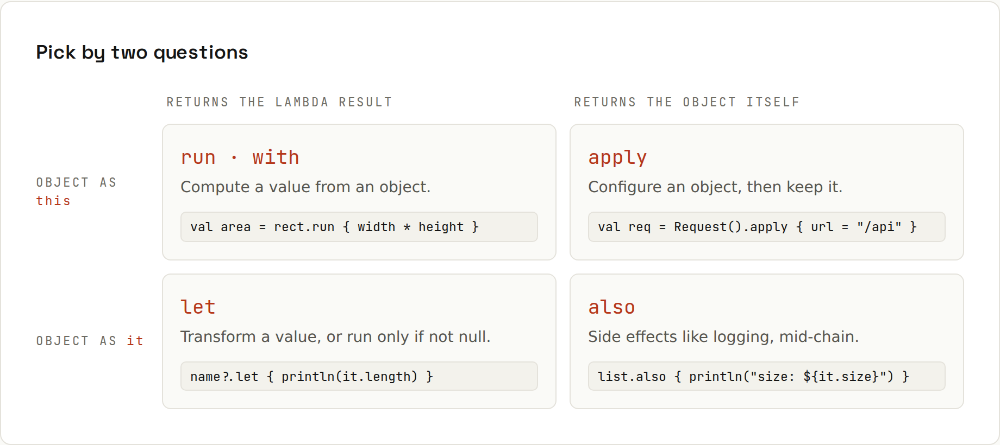

# Scope Functions

**`let`, `run`, `with`, `apply`, `also`: one grid to tell them apart.** They all run a block with an object. They differ in only two ways: how you refer to the object inside (`this` or `it`), and what the call returns (the lambda's result or the object itself). Output from `code/kotlin/src/main/kotlin/ScopeFunctions.kt`.



| | Returns the lambda result | Returns the object itself |
|---|---|---|
| **object as `this`** | `run`, `with` | `apply` |
| **object as `it`** | `let` | `also` |

## apply: configure an object, keep it
```kotlin
val request = Request().apply {
    url = "https://api.example.com/orders"
    method = "POST"
    headers["Content-Type"] = "application/json"
}
```
```
Request(url=https://api.example.com/orders, method=POST, headers={Content-Type=application/json})
```

## also: side effects mid-chain
```kotlin
val numbers = mutableListOf(3, 1, 2).also { println("before sorting: $it") }.apply { sort() }
```
```
before sorting: [3, 1, 2]
after: [1, 2, 3]
```
Logging, validation, adding to a registry, without breaking the chain.

## let: transform, or run only if not null
```kotlin
val email: String? = "ADA@EXAMPLE.COM"
val normalized = email?.let { it.trim().lowercase() } ?: "none"
```
```
ada@example.com
```
`x?.let { … }` is the idiomatic "if not null, do this with it".

## run: compute a value with `this`
```kotlin
val summary = request.run { "$method $url (${headers.size} header)" }
```
```
POST https://api.example.com/orders (1 header)
```

## with: like run, for an object you already have
```kotlin
val report = with(StringBuilder()) {
    appendLine("Report")
    appendLine("orders: 3")
    toString()
}
```
```
Report
orders: 3
```

## takeIf / takeUnless
```kotlin
val port = "8080".toIntOrNull()?.takeIf { it in 1..65535 } ?: 443
```
```
port 8080
```
Returns the object if the condition holds, else `null`: pairs well with `?:`.

## Don't overdo it
Scope functions are about readability. Nesting three of them (`a.let { b.apply { c.also { … } } }`) makes `this`/`it` ambiguous. If a plain `val` and two statements are clearer, use those. A good rule: at most one scope function per expression, and name `it` when the block is longer than a line (`email?.let { address -> … }`).
