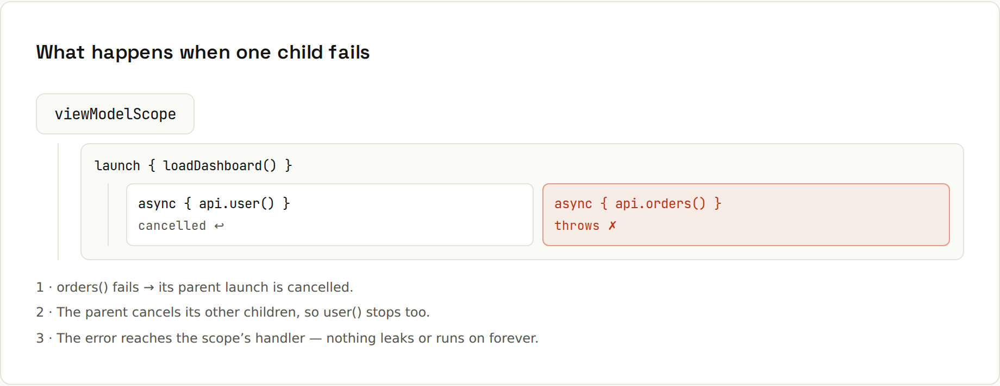

# Structured Concurrency

**Coroutines live in scopes, and scopes clean up after them.** Every coroutine has a parent. A parent waits for its children, cancelling the parent cancels the children, and a failing child cancels its siblings. Nothing is left running by accident. Output from `code/kotlin/src/main/kotlin/StructuredConcurrency.kt`.



## One child fails, the sibling is cancelled
```kotlin
suspend fun slowUser(): String {
    try { delay(5_000); return "never" }
    catch (e: CancellationException) { println("  slowUser() was cancelled"); throw e }
}
suspend fun failingOrders(): Int { delay(100); throw IllegalStateException("order service down") }

try {
    coroutineScope {
        async { slowUser() }
        async { failingOrders() }
    }
} catch (e: IllegalStateException) {
    println("failed after ~… ms: ${e.message}")
}
```
```
  slowUser() was cancelled
failed after ~100 ms: order service down
```
The scope fails after 100 ms, not 5 s: the error cancelled the slow sibling, and nothing leaks. Java is adopting the same idea as `StructuredTaskScope` (preview; see the [Java 27 wiki](https://lfdiego.xyz/wiki/java27/)).

## supervisorScope: siblings keep running
When children are independent (the page still works without the ads):
```kotlin
supervisorScope {
    val a = async { delay(50); "profile loaded" }
    val b = async<String> { delay(10); throw IllegalStateException("ads failed") }
    println("  ${a.await()}")
    println("  ${runCatching { b.await() }.exceptionOrNull()?.message}")
}
```
```
--- supervisorScope: siblings keep running
  profile loaded
  ads failed
```

## launch vs async
| | `launch` | `async` |
|---|---|---|
| Returns | `Job` | `Deferred<T>` |
| Get the result | – (fire and forget) | `await()` |
| Exceptions | propagate to the parent immediately | thrown from `await()` (and cancel the parent in a normal scope) |
| Use for | side effects: save, log, update UI | values you need back |

## Cancellation is cooperative
Cancelling only stops a coroutine at a **suspension point**. Long CPU loops should call `ensureActive()` or `yield()`:
```kotlin
suspend fun cpuWork(): Int = withContext(Dispatchers.Default) {
    var n = 0
    for (i in 1..50_000_000) {
        if (i % 1_000_000 == 0) ensureActive()      // cooperative cancellation point
        n += i % 7
    }
    n
}
```
```
CPU loop cancelled: true
```

## Don't swallow CancellationException
Cancellation is delivered as a `CancellationException`. A broad `catch (e: Exception)` catches it too:
```kotlin
val job = launch {
    try { delay(1000) } catch (e: Exception) { println("  swallowed ${e::class.simpleName} (don't do this)") }
    println("  still running after cancel: isActive=$isActive")
}
delay(50); job.cancel(); job.join()
```
```
--- catching CancellationException by accident
  swallowed JobCancellationException (don't do this)
  still running after cancel: isActive=false
```
The coroutine kept running code after it was cancelled. Rethrow it (`catch (e: CancellationException) { throw e }` first), or catch only the exceptions you mean. The same applies to `runCatching` around suspend calls ([[kotlin/Error Handling]]).

## Your own scopes
```kotlin
val handler = CoroutineExceptionHandler { _, e -> println("handler: ${e.message}") }
val scope = CoroutineScope(SupervisorJob() + Dispatchers.Default + handler)
scope.launch { throw IllegalStateException("background task crashed") }.join()
scope.cancel()          // when the owner (a service, a screen) is destroyed
```
```
handler: background task crashed
```
A component that starts background work owns a scope and cancels it when it shuts down. On Android, `viewModelScope` does exactly this for you.

## Rules
1. Launch coroutines in a scope with a clear owner and lifetime, never `GlobalScope`.
2. Use `coroutineScope` inside suspend functions to run things in parallel.
3. Use `supervisorScope` / `SupervisorJob` when children are independent.
4. Make CPU loops cancellable; never swallow `CancellationException`.
5. Switch to `Dispatchers.IO` for blocking calls, and back automatically when the block ends.
