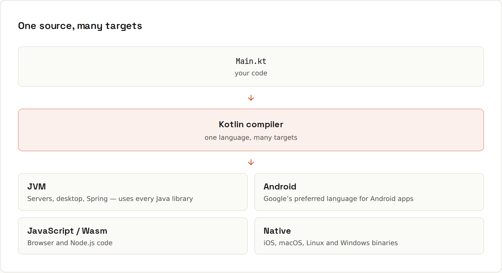

# What Is Kotlin

**A modern language for the JVM, and well beyond it.** Built by JetBrains (the company behind IntelliJ IDEA), first stable in 2016, fully interoperable with Java, and the default for Android. The same code can also compile to JavaScript, WebAssembly and native binaries.



| Target | Output | Used for |
|---|---|---|
| **Kotlin/JVM** | `.class` bytecode, like Java | backends, Android, desktop, tools |
| **Kotlin/Android** | JVM bytecode → Android's ART | Android apps |
| **Kotlin/Native** | machine code via LLVM | iOS, macOS, Linux, Windows binaries |
| **Kotlin/JS** | JavaScript | web frontends |
| **Kotlin/Wasm** | WebAssembly | web apps with Compose Multiplatform |

## Mix Java and Kotlin freely
Kotlin calls Java libraries directly, and Java calls Kotlin back. You can add a single `.kt` file to an existing Java project and grow from there; no rewrite needed. The example project for this guide mixes both: a Java `PriceCalculator` used from Kotlin and calling Kotlin back ([[kotlin/Java Interop]]).

## Design goals
- **Concise**: data classes, type inference, default arguments, string templates, lambdas everywhere.
- **Safe**: nullability is part of the type system ([[kotlin/Null Safety]]); `val` by default; classes are `final` by default.
- **Pragmatic**: works with every Java library and tool you already know; no new runtime.
- **Tooling first**: designed together with IntelliJ IDEA's refactorings and inspections; *Convert Java File to Kotlin* translates existing code.

## Versions
Kotlin releases a language version twice a year (2.x.0) with tooling releases (2.x.20) in between. Kotlin 2.0 (2024) introduced the new **K2** compiler: much faster and the base for new features. This guide uses **2.4.20**. The [Kotlin wiki](https://lfdiego.xyz/wiki/kotlin/) covers what's new in each version.

## Hello, Kotlin
```kotlin
fun main() {
    println("Hello, Kotlin")
}
```
No class needed: functions can live at the top level of a file. A file `Main.kt` compiles to a class `MainKt` (that's why the examples here run as `BasicsKt`, `FunctionsKt`…).

## Running it
- **IntelliJ IDEA**: *New Project → Kotlin*, click the green ▶ next to `main` ([[IDEs/Project Setup]]).
- **Gradle**: `./gradlew run` with the `application` plugin ([[kotlin/Gradle and Project Setup]]).
- **Kotlin Playground** (play.kotlinlang.org): run snippets in the browser.
- **Scripts**: `.main.kts` files run with `kotlin script.main.kts`.

## Next
Coming from Java? Start with [[kotlin/Kotlin for Java Developers]].
